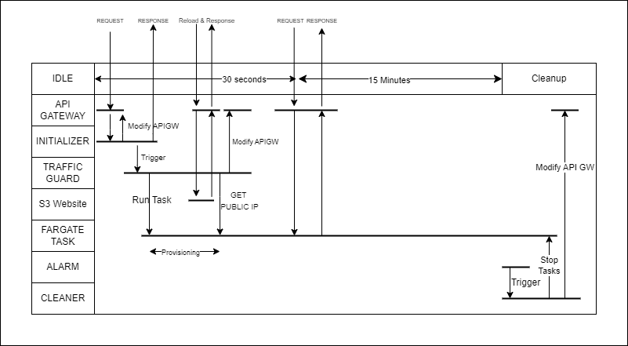

# CHEAP SERVERLESS APPLICATION

This is a design for cheap serverless application. \
AWS does not support fargate scale to 0 so for that reason you need to have at least 1 task running. But for unfrequent web applications to have 1 task it is still an expensive option.\
For this reason this architecture provides an automated option to expose your application that runs on ECS Fargate with 1 task.

## Architecture


**Services:**
- API Gateway
- S3 Website
- 3 Lambda
- Cloud Watch Alarm

## Service Functions

### API GATEWAY
API Gateway is point-of-entrance , this service is used to: 
- handle https communication by using Certificate Manager ACM and API Gateway domain
- handle routing of requests 

### Lambdas
Initializer Is the first lambda ,which is used for :
- being the first to get triggered 
- delete route of api gateway that links to itself
- triggers lambda 2 asynchronusly 
- provide a html response 

Traffic Guard is the second lambda, which is used for:
- Run Task on ECS Cluster
- Wait for task to run and get it's Public IP
- Change the target of API Gateway to the new Task that got created

Cleaner is the third lambda, which is used for:
- Stop all tasks on the ECS cluster
- Create new route "GET /" for API Gateway
- Set as target the integrator of "Initializer Lambda"

### S3 Website
We need a page that provides us with an information that this web application is spinning up, so for this we need an endpoint , for that we are using this website on s3 bucket.
When there is no ecs task running , the api gateway redirects to lambda and if a request is resend then it will need an endpoint to target, for this reason we need this s3 website, it can be a dummy endpoint such as "https://example.com" ,but to be more precise and informative , website that provides this information is set.

### Cloud Watch Alarm
To not create costs , we need to keep an eye at the connections to the api gateway, which has a metric named "Count". With this metric we can set an alarm that when there is in "alarm" state , it means that there are connections ,when it changes to "OK Status" it will trigger our third lambda "Cleaner" which will clean the tasks running and fix the routing paths.

## Time Table of Actions


**Workflow:**
- User requests the website
- API Gateway routes the traffic to "INITIALIZER" lambda
- INITIALIZER Removes the GET / route on the api gateway , triggers "Traffic Guard" lambda and return a response to user
- User will be displayed with a wait webpage that in case of reload , api gateway will be routing the traffic to S3 website
- Traffic Guard will run new task on the cluster, wait 10 seconds to get its NIC Public IP and modify the ANY / route on api gateway to new IP
- After 30 seconds the page will automatically reload and API Gateway points to the new ECS Fargate task that got created
- After 15 minutes of no connection there will be an alarm that meanwhile was triggered , when it changes to OK Status it will trigger the "Cleaner" lambda 
- Cleaner lambda will stop the tasks and it will add the Get / route to API Gateway that it will point to Initializer lambda.

## How to Deploy
I have used terraform to deploy the whole environment. To deploy you would need :
- AWS Credentials 
- Terraform Installed

```bash
cd terraform

#Initialize terraform modules/providers
terraform init

#Plan terraform to see what it creates
terraform plan

#If everything is ok , Apply to deploy the infrastructure
terraform apply
```

### How To Modify
If you want to run your own application you would need to make the changes on the ECS Task definition for your own application, but this depends on your application, and specified on "ecs.tf" file.
In case you have more complex achitecture (such as 3 tier application) , you need to figure it out yourself :P.
